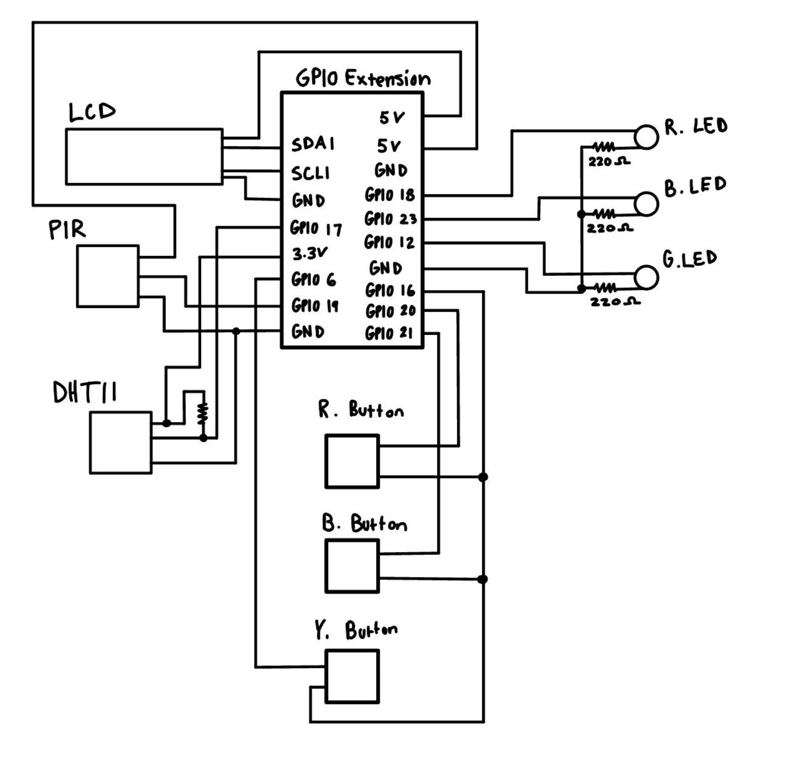
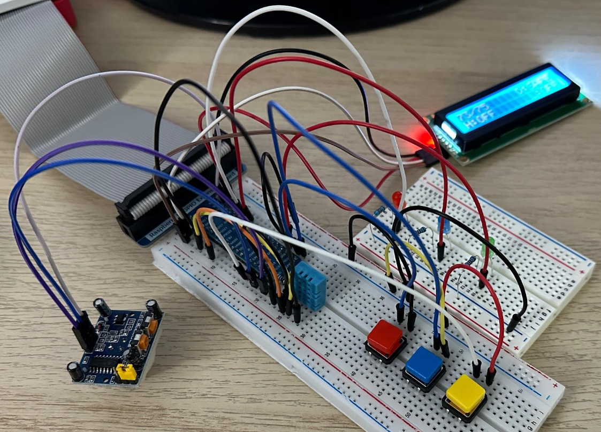

# raspberry-pi-building-management

Raspberry pi project that emulates a building management system. Uses LEDs, LCD, buttons, DHT-11 temperature/humidity sensor, and PIR motion sensor. 

**Ambient light control:** If motion is detected, turn on lights and keep on until motion is not detected for 10 seconds. The status of the lights is displayed on the LCD.

**Room temperature (HVAC):** Measure ambient air tempature using DHT-11 sensor and gather local humidity from [CIMIS API](https://cimis.water.ca.gov/). A weather index is calculated and shown on the LCD. The user is able to set HVAC temperature using buttons and the HVAC will turn on if HVAC temperature is more than 3 degrees away. HVAC is also turned off if doors/widows are opened and when fire alarm is active.

**Fire Alarm system:** The fire alarm is triggered if the indoor weather index exceeds 95 degrees. The HVAC is turned off and all doors/windows are opened. 

**Energy bill generator:** Records energy consumption when HVAC is active. Energy estimate is displayed on the LCD.

**Security system:** Display door/window status on LCD and will open when fire alarm is activated.

## Schematic

## Circuit Image
